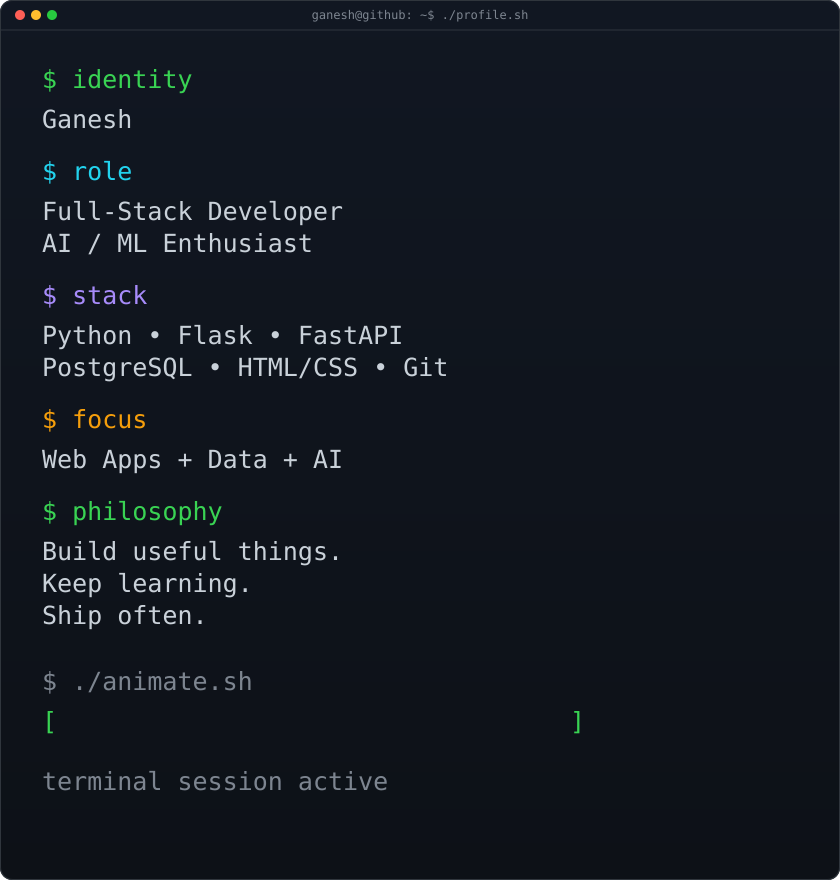
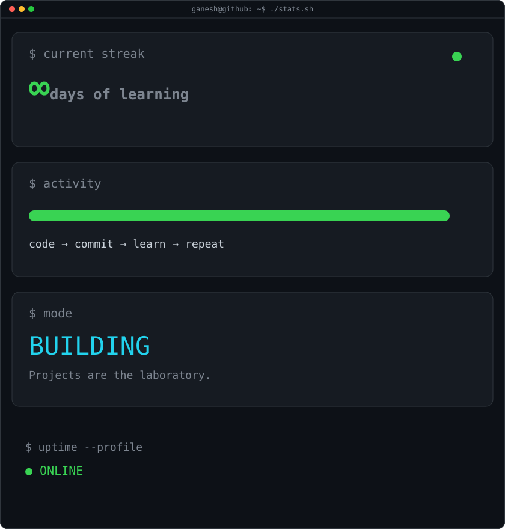
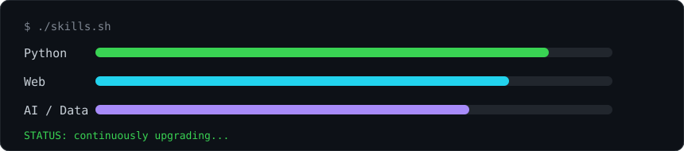

<!-- =========================================================
     GANESH • TERMINAL PROFILE
     Visual structure inspired by the uploaded reference project.
     ========================================================= -->

  

<h3><code>ganesh@github ~ $ ./contributions.sh</code></h3>

  

<h3><code>ganesh@github ~ $ whoami</code></h3>

<table>
<tr>
<td valign="top" width="50%">

</td>
<td valign="top" width="50%">

</td>
</tr>
</table>

  

<h3><code>ganesh@github ~ $ ./skills.sh</code></h3>

  

<h3><code>ganesh@github ~ $ ./links.sh</code></h3>

<b>Full-Stack Developer · AI/ML Enthusiast · Builder</b>

<!-- Replace these with your real profiles before publishing -->

  

<!--
  Animation notes:
  • terminal-banner.svg: animated terminal typing / scanline effect
  • ganesh-terminal.svg: animated command output
  • stats-card.svg: animated counters and bars
  • skills.svg: animated skill meters
  • footer.svg: animated neon-style activity line

  GitHub profile README files do not execute JavaScript. These animations
  are therefore implemented as SVG animation, which can render inside img tags.
-->
